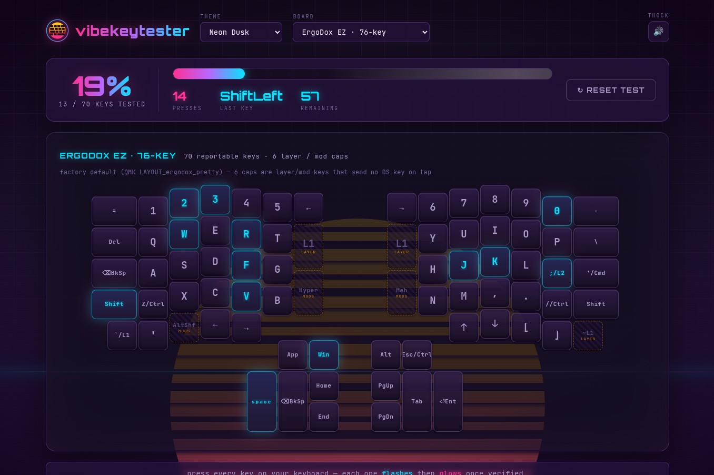

# vibekeytester

A **synthwave keyboard key tester** that works with a whole catalog of boards.
Pick your keyboard from the dropdown and press every physical key — each press
makes the matching cap on the on-screen layout **flash**, then settle into a
subtle glowing "verified" state. A progress bar tracks how many keys you've
tested from **0 → 100%**.

Keeps the look of the original vibetyper: 8 synthwave themes, the **thock**
keyboard sound, and the retrowave sun/grid/scanline backdrop. Ships as a
single-file **Linux executable** that opens a webapp in your browser.



---

## Quick start (run from source)

**Requirements:** [Node.js](https://nodejs.org) ≥ 18. No other runtime
dependencies — the server uses only Node built-ins.

```bash
npm start          # node server/index.js
```

Open **http://localhost:8080** (set `PORT` to change it). The server opens your
browser automatically — set `VIBE_NO_OPEN=1` to suppress that.

---

## Install the Linux executable

Download/build **`bin/linux-x64/vibekeytester`**, then:

```bash
chmod +x vibekeytester
sudo mv vibekeytester /usr/local/bin/vibekeytester
vibekeytester
```

It opens your browser and creates **`~/.vibekeytester/`** on first run — no
installer, nothing to create by hand.

## Building the executable yourself

**Requirements:** [Bun](https://bun.sh) ≥ 1.x (the compiler) and Node ≥ 18.

```bash
npm run build:linux    # embed assets → compile Linux x64 → bin/linux-x64/vibekeytester
```

The build embeds the frontend and thock sound pack into the binary, so the
only thing it writes at runtime is your settings.

---

## The app

### What it does

- Draws a synthwave mock of the selected keyboard — individual neon keycaps in
  the familiar arrangement. No keyboard photo: just the keys.
- Watches the **physical keyboard** (`KeyboardEvent.code`), so it works with
  whatever the OS reports, regardless of the printed layout or OS layout.
- On press: the keycap **flashes**, then **glows** with the current theme's
  synthwave colors once tested.
- **Progress bar 0 → 100%** for the active board: live count, total presses,
  last key detected, and how many reportable keys are left.
- Keys that report a code not drawn on the selected board land in an
  **"extra keys detected"** strip so nothing you press goes unnoticed.
- Tested keys are remembered **per board layout** across reloads; the
  **↻ reset test** button clears only the active board.

### Boards

| group | boards |
| --- | --- |
| **Standard** | Full-size 104-key US · TKL (80%) 87-key US · 75% · 65% · 60% · 40% ortholinear (Planck-style) |
| **Split & ergonomic** | ErgoDox EZ · Moonlander Mark I · MoErgo Glove80 · MoErgo Go60 · Dygma Raise 2 · Dygma Defy |

Standard-size layouts are representative US-ANSI arrangements (see the note
under each board). Split boards are drawn from their **factory-default base
layer** (verified against QMK/ZSA, MoErgo's layout editor/ZMK, and Dygma
Bazecor), so on a stock board each keycap lights as you press it. Two things
to know about split boards:

- Keys that only switch **layers** (no OS key event) are shown with dashed
  caps and a small `layer`/`mod` tag — pressing them can't light the board,
  that's expected, not a fault.
- If your board is **re-mapped**, the tester still proves every switch works:
  whatever code a key sends lights the matching cap (or shows in the extra-key
  strip if it isn't on the layout).

### Controls

| control | what it does |
| --- | --- |
| **board dropdown** | pick the keyboard layout you're testing (grouped: Standard / Split & ergonomic) |
| **theme dropdown** | 8 color themes (Neon Dusk, Outrun, Vaporwave, Cyberpunk, Midnight Grid, Chrome, Toxic Glow, Retro Arcade) — instant CSS swap |
| **thock** (🔊) | toggle the mechanical keyboard click sound |
| **↻ reset test** | clear the active board's lit keys and start over |

### Notes & limitations

- Some keys can't be observed by a web page at all because the OS or browser
  swallows them first (e.g. `Fn`, `Print Screen`, `Ctrl+Alt+Del`, some `Win`
  combinations). The footer hints at this — don't blame the board for those.
- Keys are matched by physical position code, not by the character produced, so
  the tester works regardless of active layout/language.
- Split-board geometries are flat, stylized maps of the physical boards — they
  show every key in the right cluster, not a photo-real curved layout.

---

## User data

On first run the app creates **`~/.vibekeytester/`** (hidden — leading dot):

| file | contents |
| --- | --- |
| `settings.json` | theme, sound on/off |

Set `VIBE_DATA_DIR=/some/path` to relocate it (handy for tests). Deleting the
folder returns you to a fresh state.

### Keyboard sound

- `thock/` — the keyboard sound pack (`config.json` + `sound.ogg`).

---

## API

| route | description |
| --- | --- |
| `GET /api/health` | liveness check |
| `GET /api/settings` | persisted UI settings (theme, sound) |
| `POST /api/settings` | `{ settings }` — merge + persist UI settings |

---

## Project layout

```
public/            # frontend
  index.html
  css/style.css
  js/app.js          # renderer + key capture + sound + settings
  js/keyboards.js    # layout catalog (all boards as data)
  assets/logo.svg
server/            # zero-dependency HTTP server
  index.js           # static + thock + settings + browser-open
  embedded.mjs       # generated asset bundle (public/thock)
scripts/           # build tooling
thock/             # keyboard sound pack (config.json + sound.ogg)
bin/linux-x64/     # compiled executable (vibekeytester)
```
